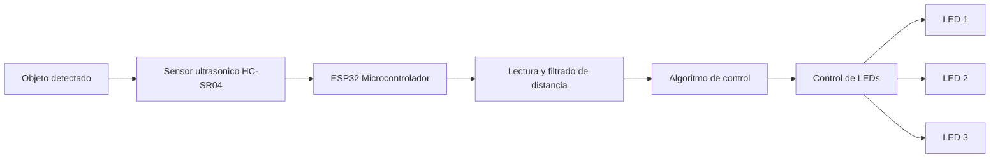

# 1. Requerimientos Funcionales y No Funcionales

### 1.1 Requerimientos Funcionales

        El sistema debe ser capaz de medir la distancia hacia un objeto cercano, encendiendo:
            - Un led color verde a una distancia entre 20 cm a 30 cm.
            - Un led color amarillo a una distancia entre 10 cm a 20 cm.
            - Un led color rojo a una distancia entre 5 cm a 10 cm.
            - Los 3 leds parpadean a una distancia mayor a 3cm.

# 1.2 Requerimientos No Funcionales

    - El sistema debe medir distancias con un margen de error aproximado de +- 3 cm
    - El software debe estar estructurado utilizando programación orientada a objetos, separando el control del sensor y de los LEDs en clases independientes.
    - El sistema debe utilizar múltiples muestras para reducir fluctuaciones en la lectura del sensor.

# 2. Diseño del Sistema

### 2.1 Diagrama de Bloques

### 2.2 Diagrama de Circuito

                    ESP32-WROOM-32
                ┌──────────────────┐
                │                  │
    5V ──────────┤5V            G15 ├──────── TRIG (HC-SR04)
                │                  │
    GND ─────────┤GND           G2  ├──────── ECHO (HC-SR04)
                │                  │
                │              G5  ├───[220Ω]───|>|─── GND   LED1
                │                  │
                │             G18  ├───[220Ω]───|>|─── GND   LED2
                │                  │
                │             G19  ├───[220Ω]───|>|─── GND   LED3
                │                  │
                └──────────────────┘

                HC-SR04 Sensor
                ┌─────────────────┐
    5V ─────────┤ VCC             │
    G15 ────────┤ TRIG            │
    G2  ────────┤ ECHO            │
    GND ────────┤ GND             │
                └─────────────────┘

### 2.3 Diagrama de Arquitectura del Sistema

### 2.4 Diagramas Estructurales y de Comportamiento

# 3. Implementacion

La implementación del sistema se realizó utilizando un microcontrolador ESP32 como unidad de procesamiento principal, un sensor ultrasónico HC-SR04 para la medición de distancia y tres LEDs que funcionan como indicadores visuales.

El software fue desarrollado utilizando programación orientada a objetos, dividiendo el sistema en dos clases principales:

- **SensorUltrasonico**: encargada de realizar las mediciones de distancia.
- **ControlLeds**: encargada de gestionar el comportamiento de los LEDs.

La clase del sensor se encarga de generar el pulso de activación del sensor ultrasónico, medir el tiempo de retorno del eco y calcular la distancia utilizando la velocidad del sonido. Para mejorar la estabilidad de las mediciones, el sistema realiza **7 lecturas consecutivas del sensor** y aplica un **filtro de mediana**, descartando valores inválidos y seleccionando el valor central de las mediciones ordenadas.

La clase encargada de los LEDs controla el encendido, apagado y parpadeo de los LEDs según el rango de distancia detectado.

El algoritmo principal ejecuta continuamente las siguientes acciones:

1. Realizar múltiples mediciones de distancia con el sensor ultrasónico.
2. Filtrar las mediciones utilizando un filtro de mediana.
3. Evaluar la distancia obtenida.
4. Activar el comportamiento correspondiente de los LEDs.

El sistema se ejecuta de forma continua dentro del bucle principal (`loop`) del microcontrolador, permitiendo actualizar constantemente el estado de los actuadores en función de la distancia detectada.

### 3.1 Codigo Fuente Documentado

# 4. Pruebas y Validasiones

| Objeto            | Distancia Real (cm) | Error (cm) | Error (%) |
|-------------------|---------------------|------------|-----------|
| Bloque de madera  | 30                  | 0.5        | 1.67 %    |
| Bloque de madera  | 20                  | 1          | 5 %       |
| Bloque de madera  | 10                  | 2.5        | 25 %      |
| Bloque de madera  | 5                   | 1          | 20 %      |
| Bloque de madera  | 3                   | 1          | 33.33 %   |
| Celular           | 30                  | 1          | 3.33 %    |
| Celular           | 20                  | 1.5        | 7.5 %     |
| Celular           | 10                  | 1          | 10 %      |
| Celular           | 5                   | 1.5        | 30 %      |
| Celular           | 3                   | 1          | 33.33 %   |
| Caja de cartón    | 30                  | 1          | 3.33 %    |
| Caja de cartón    | 20                  | 2          | 10 %      |
| Caja de cartón    | 10                  | 1.5        | 15 %      |
| Caja de cartón    | 5                   | 2.5        | 50 %      |
| Caja de cartón    | 3                   | 0.5        | 16.67 %   |

### Análisis de resultados

    Las pruebas muestran que el sensor ultrasónico presenta mayor precisión en distancias largas (20–30 cm), donde el porcentaje de error se mantiene generalmente por debajo del 10%.

    Sin embargo, al disminuir la distancia (5 cm y 3 cm) el porcentaje de error aumenta significativamente. Esto se debe a limitaciones propias del sensor HC-SR04, el cual tiene menor precisión en distancias muy cortas.

    También se observó que el tipo de objeto influye ligeramente en la medición, debido a factores como la textura y la capacidad de reflejar la onda ultrasónica.

# 5. Resultados

El sistema desarrollado logró medir correctamente la distancia hacia diferentes objetos y activar los LEDs correspondientes según los rangos definidos en los requerimientos funcionales.

Durante las pruebas realizadas se observó que el sistema responde de forma adecuada al acercamiento y alejamiento de los objetos frente al sensor ultrasónico. El comportamiento de los LEDs se organizó en diferentes niveles de alerta:

- Distancias mayores a **30 cm**: todos los LEDs permanecen apagados.
- Distancias entre **20 cm y 30 cm**: se enciende el primer LED.
- Distancias entre **10 cm y 20 cm**: se encienden dos LEDs.
- Distancias entre **5 cm y 10 cm**: se encienden los tres LEDs.
- Distancias entre **3 cm y 5 cm**: los tres LEDs parpadean como señal de proximidad crítica.

La utilización de múltiples muestras y un filtro de mediana permitió mejorar la estabilidad de las mediciones, reduciendo el efecto de fluctuaciones ocasionales del sensor ultrasónico.

En general, el sistema respondió correctamente a los cambios de distancia, proporcionando una retroalimentación visual clara mediante los LEDs.

# 6. Concluciones

El desarrollo de esta práctica permitió comprender la integración entre sensores, actuadores y microcontroladores para la construcción de objetos inteligentes.

Se logró implementar un sistema funcional capaz de medir distancias utilizando un sensor ultrasónico y activar diferentes actuadores en función del rango de distancia detectado. El microcontrolador ESP32 fue capaz de procesar la información proveniente del sensor y ejecutar el algoritmo de control en tiempo real.

Además, la implementación del sistema utilizando programación orientada a objetos permitió estructurar el software de manera modular mediante clases independientes para el sensor y el control de LEDs. Esto facilita la comprensión del código y permite realizar futuras ampliaciones del sistema.

También se implementó un filtrado de las mediciones utilizando múltiples muestras y un filtro de mediana, lo que permitió reducir las fluctuaciones en las lecturas del sensor y mejorar la estabilidad del sistema.

Finalmente, las pruebas realizadas permitieron evidenciar el comportamiento del sensor ultrasónico y sus limitaciones en distancias muy cortas, aspecto importante a considerar en aplicaciones reales de sistemas embebidos.

# 7. Recomendaciones

Para mejorar el rendimiento y la precisión del sistema en futuras implementaciones, se sugieren las siguientes recomendaciones:

- Incorporar un sistema de calibración inicial que permita ajustar las mediciones del sensor según las condiciones del entorno.
- Añadir más tipos de actuadores, como buzzer o servomotores, para generar alertas sonoras o movimientos automáticos.
- Implementar una interfaz de monitoreo mediante comunicación serial o conexión WiFi del ESP32 para visualizar las mediciones en tiempo real.
- Diseñar una carcasa o estructura física que permita proteger los componentes electrónicos y mejorar la presentación del prototipo.

Estas mejoras permitirían ampliar las funcionalidades del sistema y acercarlo a aplicaciones reales dentro del ámbito de los sistemas embebidos y el Internet de las Cosas (IoT).

# 8. Anexos

*Figura 8.1: Prototipo del sistema de medición de distancia basado en ESP32, sensor ultrasónico HC-SR04 y LEDs indicadores.*

---

*Figura 8.2: Papel usado para las mediciones realizadas durante las pruebas experimentales del sistema.*

---

*Figura 8.3: Tabla de madera utilizada como objeto de referencia para las mediciones de distancia.*

---

*Figura 8.4: Rollo de papel utilizado como objeto adicional durante los experimentos para evaluar la respuesta del sensor.*
